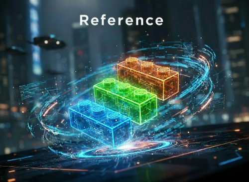

---
# markdownlint-disable
# vale  off
layout: default
parent: Reference docs
# tags used by AI files
description: GET all `collections` from the collection resource
tags:
    - api
categories:
    - api-reference
ai_relevance: high
importance: 7
prerequisites:
    - /resource/collection
related_pages: []
examples: []
api_endpoints: 
    - GET /collection
version: "v1.0"
last_updated: "2025-12-11"
# vale  on
# markdownlint-enable
---

# Get all collections



Returns results for the [`collection`](../resource/collection.md) resource.
The results will contain all collections that are stored in the API.

## URL

```shell
{server_url}/collection
```

## cURL example

Get all collections.

### cURL command

```shell
curl http://localhost:3000/collection/
```

### cURL response

The response contains multiple collections. For this document, only 1 collection is listed below:

```json
[
  {
    "id": 1,
    "userId": 1,
    "setId": 2,
    "purchaseDate": "2023-01-15",
    "condition": "Built",
    "location": "Display Room",
    "notes": "Tallest LEGO set ever made"
  }
]
```

## Postman example

Get all collections.

### Request

**Method**:

```shell
GET http://localhost:3000/collections/
```

### Postman response

The response contains multiple collections. For this document, only 1 collection is listed below:

```json
[
    {
        "id": 1,
        "userId": 1,
        "setId": 2,
        "purchaseDate": "2023-01-15",
        "condition": "Built",
        "location": "Display Room",
        "notes": "Tallest LEGO set ever made"
    }
]
```

## Return status

| Status value | Return status | Description |
| ------------- | ----------- | ----------- |
| 200 | Success | Requested data returned successfully |
| 400 | Bad Request | There is an error with the format of the request |
| ERROR | ECONNREFUSED | The local server is not running (Postman) |
| Failed to connect | Failed to connect | The local server is not running (terminal / similar app)|
